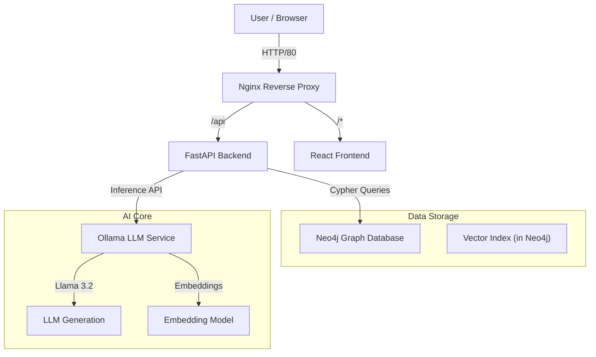
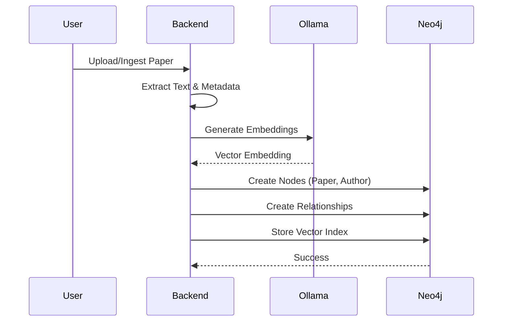

# Scientific Knowledge Graph Assistant: Comprehensive Documentation

## 1. Executive Summary
The **Scientific Knowledge Graph Assistant** is a local, AI-powered system designed to ingest scientific literature, construct a structured knowledge graph, and perform advanced retrieval-augmented generation (GraphRAG) to answer complex research questions. Unlike traditional RAG systems that rely solely on vector similarity, this system leverages the explicit relationships between papers, authors, methods, and datasets to provide deeper, context-aware insights.

## 2. System Architecture

The system is built as a containerized microservices application using Docker Compose.

### 2.1 Component Diagram


### 2.2 Tech Stack
| Component | Technology | Purpose |
| :--- | :--- | :--- |
| **Frontend** | React, TypeScript, Vite | User Interface, Interactive Graph Visualization (Cytoscape.js), Analytics Dashboard (Recharts). |
| **Backend** | Python, FastAPI | API Server, GraphRAG orchestration, Analytics logic. |
| **Database** | Neo4j Community | Storing the Knowledge Graph and Vector Index. |
| **AI Engine** | Ollama | Running local LLMs (Llama 3.2, etc.) for text generation and embeddings. |
| **Infrastructure** | Docker, Docker Compose | Container orchestration and deployment. |

## 3. Data Flow

### 3.1 Ingestion Pipeline



1.  **Parsing**: Raw text is extracted from scientific papers (PDF/Text).
2.  **Entity Extraction**: The backend identifies key entities: `Paper`, `Author`, `Method`, `Dataset`, `Institution`.
3.  **Graph Construction**: Nodes and relationships (`AUTHORED_BY`, `PROPOSES_METHOD`, `CITES`, `USES_DATASET`) are created in Neo4j.
4.  **Embedding**: Text chunks (abstracts/titles) are sent to Ollama to generate vector embeddings, which are stored as properties on `Paper` nodes.

### 3.2 Retrieval & Generation (GraphRAG)
1.  **Query Analysis**: User query is parsed to identify keywords and intent.
2.  **Hybrid Retrieval**:
    *   **Vector Search**: Finds semantically similar papers using cosine similarity on embeddings.
    *   **Graph Traversal**: Explores neighbors (authors, methods) of retrieved nodes to gather context.
3.  **Context Assembly**: A structured prompt is built containing the graph sub-structure and retrieved text.
4.  **Generation**: The LLM generates a grounded answer with citations.

### 3.3 Analytics & Trends
*   **Temporal Analysis**: Cypher queries aggregate publication counts and method usage over time windows.
*   **Emerging Topics**: Compares recent vs. historical paper counts to identify fast-growing keywords.
*   **Community Detection**: Analyzes the graph structure to find clusters of collaborating authors or related methods.

## 4. Advanced Features

### 4.1 Interactive Knowledge Graph
*   **Visual Exploration**: Force-directed graph visualization using Cytoscape.js.
*   **Dynamic Expansion**: Clicking nodes fetches citations and related entities, allowing users to "walk" the citation network.

### 4.2 Analytics Dashboard
*   **Trend Charts**: Visualizes the rise and fall of research methods (e.g., "Transformer", "LSTM").
*   **Research Clusters**: Automatically groups papers into thematic clusters.
*   **Path Finding**: Calculates the shortest path between two researchers or papers to find connecting works.

## 5. Related Work & Similarity

This project aligns with several state-of-the-art research directions in AI and Knowledge Engineering.

### 5.1 Similar Applications
*   **Microsoft GraphRAG**: A framework by Microsoft Research that builds community summaries from graphs to answer global questions. Our system shares the core philosophy of "Graph + Vector".
*   **Open Knowledge Maps**: A visual interface for exploring scientific topics. Our project adds the generate AI layer on top of the visual map.
*   **Causaly**: An AI platform for biomedical research that uses a massive knowledge graph.

### 5.2 Key Research Papers
*   *Edge, D., et al. (2024). "From Local to Global: A Graph RAG Approach to Query-Focused Summarization."* (Microsoft Research)
*   *Pan, S., et al. (2024). "Retrieval-Augmented Generation with Graphs."* (Comprehensive Survey)
*   *Wang, X., et al. (2023). "Knowledge Graph-Enhanced Retrieval-Augmented Generation for Accurate Question Answering."*

## 6. Deployment Guide

### Prerequisites
*   Docker & Docker Compose
*   (Optional) NVIDIA GPU for faster inference

### Setup
```bash
# 1. Clone Repository
git clone <repo_url>

# 2. Build and Run
docker-compose up -d --build

# 3. Access
# Frontend: http://localhost:3000
# Backend API: http://localhost:8000/docs
# Neo4j Browser: http://localhost:7474
```
